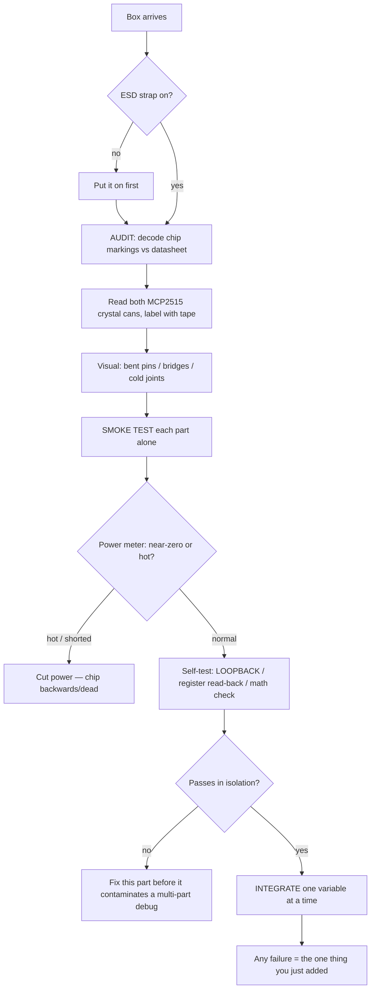
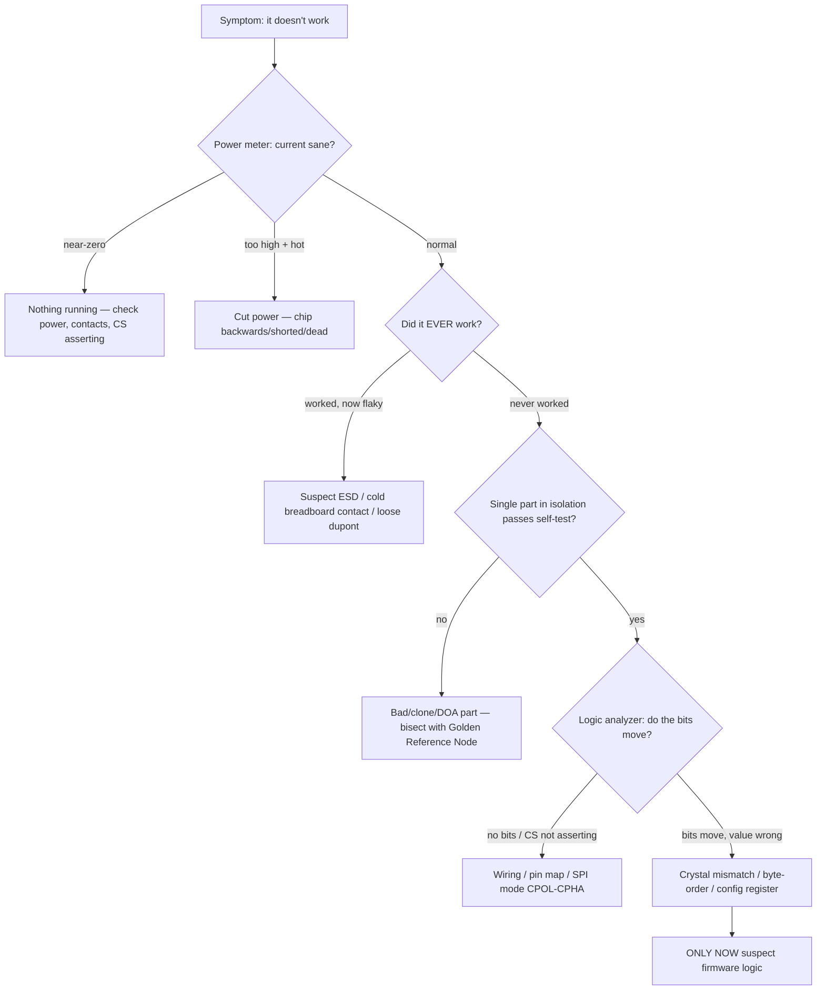

# POC Hardware Manual — Build It, Understand It

> **Audience.** Justin (self), as the hands-on builder — you write the software; this manual is the hardware half.
> **The ask.** Build Concept A rung-by-rung; for each rung, write the "what's actually happening in the silicon" note. Success = you can *explain* the hardware, not that the demo passes. When it breaks, **suspect the physical layer first**.
> **Framework.** Pyramid (answer-first overview → procedural body).  **Format.** Narrative (report).  **Budget.** ~4500 words; read once, return per rung.

## Outline

0. **Orientation** — the rig, and the one rule: the deliverable is hardware literacy, suspect the physical layer first. ([learning-hardware](../concepts/learning-hardware-as-a-software-dev.md), [POC](../concepts/poc-mini-molecule-cloud-workbench.md))
1. **The mental model** — the three software-instinct traps + the misattribution meta-skill. ([learning-hardware](../concepts/learning-hardware-as-a-software-dev.md), [discovery](../discoveries/poc-unknown-unknowns.md))
2. **Know your parts** — annotated per-part reference. ([BOM](../queries/poc-hardware-bom.md), [adom-tech-arch](../concepts/adom-technical-architecture.md))
3. **Day one — the arrival → bring-up ritual.** ([BOM](../queries/poc-hardware-bom.md), [discovery](../discoveries/poc-unknown-unknowns.md))
4. **The build ladder — rungs 0–6.** ([learning-hardware](../concepts/learning-hardware-as-a-software-dev.md), [BOM build note](../queries/poc-hardware-bom.md), [molecules](../concepts/molecules-and-workcells.md))
5. **The diagnosis playbook + the ask.** ([learning-hardware](../concepts/learning-hardware-as-a-software-dev.md))

## Style

- **Narrative shape — report.** Numbered sections, bench-reference register, archival. Read end-to-end once, then return to a single rung at the bench. Plain semantic HTML + hand-written CSS, no framework.
- **Accent — amber/orange.** Workshop/caution valence: ESD, "current going where it shouldn't," no `git reset`. Dark-mode-first, respects `prefers-color-scheme`.
- **Diagram tools:**
  - §1 — three trap cards (CSS + HTML).
  - §2 — per-part reference cards (CSS grid).
  - §3 — arrival/bring-up ritual flow (Mermaid flowchart).
  - §4 — learning-ladder progression (CSS + HTML); ASCII pin-connection tables per rung; one inline-SVG 2-node CAN bus topology at rung 2.
  - §5 — suspect-physical-first diagnosis tree (Mermaid).
- **Derived-not-cited markers.** Exact GPIO pin assignments are derived from the Pico 2 pinout + chosen modules, not from the Arche. They are labelled **⚙ derived — verify on the bench**. The Arche only fixes the safe range (GP10–GP21, avoid GP23/24/25/29 on the W) and the LED on GP15 ([BOM](../queries/poc-hardware-bom.md)).

## Sections

### 0. Orientation — what you're building and the one rule

You are building **Concept A — the Mini-Molecule + Cloud Workbench**: a small board that self-identifies on a bus and is driven from a browser, reading a sensor and driving an actuator, end to end ([POC: Mini-Molecule + Cloud Workbench](../concepts/poc-mini-molecule-cloud-workbench.md)). You will write the software with skills you already have. This manual is the other half: the physical build and — more importantly — the *understanding*.

**The one rule, stated first (Pyramid answer):** the deliverable is **hardware literacy, not a working rig**. For a software developer, "get it working" is a trap — a live bus you can't explain is worth less than a humbler one you deeply understand ([learning-hardware](../concepts/learning-hardware-as-a-software-dev.md)). So every rung below ends the same way: **write down what's actually happening in the silicon.** That write-up is the deliverable. The repo is a textbook you author by building ([discovery #4](../discoveries/poc-unknown-unknowns.md)).

And the corollary that governs all debugging: **when something breaks, suspect the physical layer first.** In hardware, physical failures masquerade as software bugs — a crystal mismatch reads as a "CAN bug," static damage reads as "flaky firmware," a cold contact reads as a "code bug" ([learning-hardware, misattribution](../concepts/learning-hardware-as-a-software-dev.md)). The whole manual is built to make the physical layer observable so you stop blaming code.

### 1. The mental model — why hardware breaks your software instincts

Three mental models you carry as a software dev are silently false in hardware ([learning-hardware](../concepts/learning-hardware-as-a-software-dev.md), [discovery Theme 2](../discoveries/poc-unknown-unknowns.md)). Internalize these before you wire anything.

**Trap 1 — Hardware has no `try/catch`.** A wrong value isn't a catchable exception; it's current going where it shouldn't, and the failure is physical and permanent. There is no `git reset` for a fried chip. **Measure before you connect.**

**Trap 2 — "It compiled, so it's right" — the bug is off-screen.** Clean firmware still returns garbage from a cold breadboard contact, the wrong SPI mode (CPOL/CPHA), a byte-order flip, or an unconnected MISO row. "The code is correct" should send you to the *physical* layer, not narrow the search.

**Trap 3 — State lives in the physical world, not in variables.** A floating GPIO reads noise — there is no default `0`. A chip's config registers (the MCP2515's especially) persist *inside the chip* across re-flashes. Capacitors and rails carry state: brown-out on motor start, a missing decoupling cap → mystery resets. "Initialize your variables" has a hardware twin: pull resistors, register config, decoupling caps.

**What transfers:** not every instinct betrays you — **"fail fast on the riskiest assumption" is correct**, and it's exactly why CAN moves early (rung 2) ([learning-hardware](../concepts/learning-hardware-as-a-software-dev.md)).

**The meta-skill — misattribution.** The single deepest pattern: physical failures wear software costumes. Learning to *suspect the physical layer first* is the literacy this whole POC is training ([discovery cross-cutting thread](../discoveries/poc-unknown-unknowns.md)).

*Diagram: three CSS cards, one per trap, with the software belief struck through and the hardware reality beneath.*

### 2. Know your parts — annotated reference

Specific vetted SKUs from the [POC Hardware BOM](../queries/poc-hardware-bom.md) (Amazon, vetted 2026-06-22; ASINs are stable, prices/listings drift). The "why this chip" lines map each part to the real Adom chip family it mirrors ([adom-tech-arch](../concepts/adom-technical-architecture.md)). Each card lists the **chip marking to verify** under a loupe — because *the listing lies, the silkscreen half-lies, the chip tells the truth* ([discovery #17](../discoveries/poc-unknown-unknowns.md)).

Build parts:

- **Raspberry Pi Pico 2 W (RP2350)** — `B0DP54FWX1`, ~$5–6. The molecule's brain; Rust + Embassy firmware mirrors Adom's stack. **Verify:** genuine RP2350, not a relabeled RP2040. **Voltage:** 3.3V logic. **Gotcha:** the "W" radio is unused (harmless); onboard LED is driven through the CYW43 chip not a GPIO (so use an *external* LED), and GP23/24/25/29 are reserved — the wiring map avoids them.
- **MCP2515 CAN module ×2 (with TJA1050)** — `B01D0WSEWU`, ~$7–10/pair. The CAN bus, mirroring Adom's CAN-FD bus. **Verify:** transceiver is TJA1050; **read both crystal cans (8.000 vs 16.000 MHz) and label with tape.** **Voltage:** TJA1050 wants 5V; MCP2515 logic runs 3.3V. **Gotcha:** the 5V/3.3V MISO seam and the crystal lottery — see rung 2.
- **ADS1220 24-bit ADC** — `B0DPMKMGNN`, ~$10–15. Precision delta-sigma ADC, mirroring Adom's `ads1220`. **Verify:** it is **SPI** (listings mislabel it "I2C" — the chip is SPI-only). **Gotcha:** has onboard IDAC current sources for ratiometric thermistor reads.
- **4-ch BSS138 level shifter** — `B0DLG9J81H`, ~$2. Translates 5V ↔ 3.3V on the SPI bus (esp. MISO). **Gotcha:** passive MOSFET shifter — slows push-pull rising edges, so run the MCP2515 SPI clock conservatively (~1–4 MHz). Labelled "I2C" but fine for SPI.
- **37-values component grab bag (480 pcs)** — `B099MQV8ZW`, ~$13. Resistors, **potentiometer, NTC thermistor**, transistors (2N2222), diodes (1N4007), caps, plus an 830 breadboard + power module. The component-under-test supply.
- **DC motors ×6 (3–12V)** — `B0922N8MCR`, ~$8. PWM actuation target. **Gotcha:** never drive from a GPIO — transistor + flyback diode + power from the 5V rail (rung 5).
- **Breadboards + dupont jumpers** — `B08Y59P6D1` / `B0F8VDMHRT`. A 2-node CAN bus wants **≥2 boards** (one per node); keep M-F/F-F jumpers to reach modules.
- **USB cable** — micro-USB, **data-capable** (Pico 2 W is micro-USB; the Waveshare reference node is USB-C — you'll want both).

Learning tools — *not* in the original BOM, the most important "parts" for literacy because they make the invisible physical layer observable ([BOM learning-tools](../queries/poc-hardware-bom.md), [discovery Theme 4](../discoveries/poc-unknown-unknowns.md)):

- **USB logic analyzer (8-ch, 24 MHz)** — `B077LSG5P2`, ~$10. Your debugger is a multimeter — but this lets you *watch SPI/CAN bits on the wire* with PulseView (sigrok). Non-negotiable once CAN starts; CAN failures are invisible without it.
- **Golden Reference Node — Waveshare RP2350-CAN** — `B0F4JH65HY`, ~$18. Buy **one** known-good all-in-one and build the *other* CAN node from separate parts. When the bus won't sync, swap it in to bisect "my hand-wired node + firmware" vs "the bus itself." It's 3.3V-native with a pre-matched crystal — the exact gotchas it removes are why it's trustworthy as a reference. **USB-C.**
- **USB power meter (inline V/A)** — `B07FMQZVW2`, ~$14. Current + heat are *pre-code* vital signs: near-zero = nothing running; too-high + hot = backwards/shorted chip → cut power. The "smoke" in smoke test, quantified.
- **ESD wrist strap (1 MΩ)** — `B00B2T9C8Y`, ~$8. Software devs have zero ESD reflexes; static causes *latent* damage (works today, flaky next week) you'll misattribute to firmware. Nearly-free insurance against the worst failure mode.

*Diagram: CSS-grid reference cards, one per part — marking-to-verify, voltage, key gotcha, ASIN.*

### 3. Day one — the arrival → bring-up ritual

There is **no `package-lock.json` for atoms** — no hash guarantees you got the right bytes ([discovery #16](../discoveries/poc-unknown-unknowns.md)). Every part is guilty until proven innocent: clones, mislabels, wrong crystals, DOA, missing SMD. Treat the box landing as *ready to audit*, not *ready to build*. Adopt manufacturing's receiving-inspection discipline ([BOM arrival ritual](../queries/poc-hardware-bom.md)).

**Step 1 — Audit before assembly.** Put on the ESD strap first. Then: decode chip top-markings with a loupe/phone-macro and cross-check the datasheet (ADS1220 is ADS1220, Pico is genuine RP2350, transceiver is TJA1050). **Read both MCP2515 crystal cans (8.000 vs 16.000 MHz) and label each with tape** — this 30-second step pre-empts the entire "CAN bug" misattribution spiral. Visual check for bent pins, solder bridges, missing SMD parts, cold joints on pre-soldered headers.

**Step 2 — Smoke-test each part in isolation** (unit test before integration, [discovery #20](../discoveries/poc-unknown-unknowns.md)):
- **Power it alone**, watch the USB power meter, *feel/smell* for heat → confirm a vital sign before integrating.
- **Verify against math, not an instrument you also don't trust** ([#22](../discoveries/poc-unknown-unknowns.md)): short the ADS1220 inputs → read ≈0; feed a known divider → the code must equal `(Vin/Vref) × 2²³` computed by hand.
- **Use the chips' own self-test modes:** MCP2515 **LOOPBACK** routes TX→RX internally — proves chip + SPI + firmware + crystal on *one* node, no bus. Write-a-register-then-read-it-back. The datasheet's "modes" section is a bring-up toolbox.
- **Passive parts test with a meter only:** the BSS138 needs no code — apply 3.3V one side, measure the other. Knowing *which* parts are meter-only vs code-required is itself literacy ([#24](../discoveries/poc-unknown-unknowns.md)).

**Step 3 — Integrate one variable at a time**, so any failure is unambiguously the *one* thing you just added. This is the binary-search debugger applied to atoms.

*Diagram (Mermaid flowchart):*


### 4. The build ladder — rungs 0–6

Learning order ≠ feature order. The product sequence (self-ID → bridge → measure → AI) demos well but doesn't teach safely or cumulatively. This ladder is re-ordered by **hardware-concept difficulty and blast radius** — same modules, same parts, *not* a divergence from the concept ([learning-hardware ladder](../concepts/learning-hardware-as-a-software-dev.md), [discovery Theme 3](../discoveries/poc-unknown-unknowns.md)).

Three disciplines make it a *learning* ladder:
1. **Build the instrument before the experiments** — the browser↔device loop (rung 1) is a software dev's home turf; build it early so every later rung has a self-built, software-native readout.
2. **Self-ID is the spine, not a rung** — `{id, name, capabilities:[]}` is the through-line every rung extends: `[gpio]` → `[gpio,adc]` → `[...pwm]` → over-CAN. Each lesson becomes a capability the molecule advertises — literally how an Adom [molecule](../concepts/molecules-and-workcells.md) behaves.
3. **Bloody-on-CAN** — CAN moves to rung 2 because it's the highest-gotcha *and* the Adom-signature bus; the stall there is the most informative, de-risked by LOOPBACK + the Golden Reference Node.

*Diagram: CSS ladder, rungs 0–6, each showing the new hardware concept and the growing self-ID capability list.*

> **⚙ Pin assignments below are derived** from the Pico 2 pinout + the chosen modules, **not from the Arche** — verify on the bench. The Arche fixes only: external LED on GP15, safe range GP10–GP21, avoid GP23/24/25/29 on the W ([BOM](../queries/poc-hardware-bom.md)).

#### Rung 0 — Power the Pico, blink an *external* LED, measure with a multimeter
**New concept:** GPIO, current-limit resistor, 3.3V logic, the meter as debugger. Safest first contact.
**Wiring (⚙ derived):**
```
Pico GP15 ──[ 330Ω ]──►|── GND      (LED anode→resistor→GP15; cathode→GND)
                       LED
```
**What's happening in the silicon:** GP15 is a push-pull output — driven high it sources ~3.3V; the 330Ω limits current to ~(3.3−1.8)/330 ≈ 4.5 mA so neither the LED nor the GPIO pad burns. The onboard LED won't work for this (it's behind the CYW43 wireless chip on the W), which is *why* you use an external one.
**Verify:** before connecting, measure GP15 toggling 0V↔3.3V with the multimeter. Measure across the resistor to confirm current direction. **Write-up:** why a current-limit resistor exists and what happens without it.

#### Rung 1 — Browser↔device loop (Web Serial) + self-ID spine `[gpio]`
**New concept:** serialization, the host↔device boundary, capability announcement. A software dev's home turf — build the *instrument* first.
**Wiring:** none beyond rung 0 — uses the Pico's native USB. Browser → Web Serial API → Pico directly (Chrome-only), the browser-to-serial pattern [John Lauer](../entities/john-lauer.md) pioneered.
**What's happening:** on power-up the firmware announces `{id, name, capabilities:["gpio"]}` over USB-CDC serial; the browser parses it and renders a control for the LED. This is the molecule's self-ID spine — every later rung *appends* a capability.
**Verify:** toggle the LED from the browser; confirm the capability string round-trips. **Write-up:** where the host↔device boundary sits and how a capability list makes the board plug-and-play.

#### Rung 2 — 2-node CAN (1 Waveshare reference + 1 hand-built) ⚠ the big one
**New concept:** bus arbitration, differential signaling, bit-timing. "Bloody me early" on the highest-gotcha, Adom-signature tech.

This rung carries two gotchas straight from the [BOM build note](../queries/poc-hardware-bom.md):

**(a) Crystal frequency.** Cheap MCP2515 modules ship 8 MHz *or* 16 MHz, by batch. The bit-timing config in firmware **must** match the actual crystal or the bus never syncs. You already read and labelled the cans in §3 — set the firmware constant to match. *This is the #1 misattribution trap: a mismatch reads as a "CAN bug" for hours.*

**(b) The 5V/3.3V MISO seam.** The TJA1050 transceiver wants 5V; the Pico is 3.3V. SPI is 4-wire — the Pico drives SCK/MOSI/CS (safe), but **MISO is driven by the module**, so a 5V-powered module can push 5V into a Pico GPIO and damage it over time. Mitigations simplest-first: run the whole module at 3.3V (fine on a short bench bus); or put the BSS138 level shifter on MISO (robust, reusable); or board-mod to feed only the TJA1050 5V.

**Wiring — SPI from Pico to its MCP2515 (⚙ derived):**
```
Pico            MCP2515 module
GP18 (SCK)  ─── SCK
GP19 (MOSI) ─── SI
GP16 (MISO) ─── SO     ◄── route through BSS138 if module is 5V-powered
GP17 (CS)   ─── CS
GP21 (INT)  ─── INT
3V3 / 5V    ─── VCC    (see seam note above)
GND         ─── GND
```
**Wiring — the CAN bus between the two nodes (differential pair + termination):**
```
 Node A (hand-built)              Node B (Waveshare reference)
 MCP2515/TJA1050                  RP2350-CAN
   CANH ─────────────┬──────────────── CANH
   CANL ───────────┬─┼──────────────── CANL
   GND  ──────────┐│ │ ┌────────────── GND
                 [120Ω]         [120Ω]   ← termination at BOTH ends
```
**What's happening in the silicon:** CAN is a *differential* bus — CANH/CANL swing in opposite directions, so common-mode noise cancels; that's why it's industrial-robust and why you can't see a logic level with a single-ended probe. 120Ω terminators at each end stop reflections. The MCP2515 is an SPI-controlled CAN *controller*; the TJA1050 is the *transceiver* that turns its TX/RX into the differential pair. Config registers live inside the MCP2515 and survive a re-flash (Trap 3).
**De-risk before two nodes talk:** prove one node alone in **LOOPBACK** mode (TX→RX internal — no bus, no second node). Then bring the bus up. If it won't sync, swap the **Golden Reference Node** in for your hand-built node to bisect: hand-wiring+firmware vs the bus itself. **Put the logic analyzer on the SPI lines** — confirm CS asserts and bytes move — because CAN faults are otherwise invisible.

*Diagram: inline-SVG 2-node CAN topology — the differential pair, both transceivers, both 120Ω terminators, the SPI seam highlighted on the hand-built node.*

**Verify:** LOOPBACK passes → register read-back matches → two nodes ACK each other → a frame from A appears on B. **Write-up:** what differential signaling buys you, why termination matters, and the crystal/MISO seam in your own words. (If you reach here understanding both gotchas, you can *speak to* CAN in an interview — the whole point.)

#### Rung 3 — Potentiometer via the Pico's *built-in* ADC
**New concept:** analog↔digital, resolution, reference voltage. Validates the whole software loop at ~zero hardware risk.
**Wiring (⚙ derived):**
```
3V3 ──[ pot top ]
        wiper ─── GP26 (ADC0)
GND ──[ pot bottom ]
```
**What's happening:** the pot is a voltage divider; the wiper feeds 0–3.3V to GP26 (ADC0). The RP2350's 12-bit SAR ADC returns `0–4095` ≈ `(Vin/3.3) × 4095`. This rung exists as a **variable-isolator**: it proves the entire browser→device→measure→stream loop with the *built-in* ADC, so when you swap to the ADS1220 over SPI (rung 4), the SPI chip is the *only* new variable ([discovery #11](../discoveries/poc-unknown-unknowns.md)).
**Verify:** rotate the pot, watch the value stream to the browser; check endpoints read ≈0 and ≈4095. **Write-up:** what "12-bit resolution against a 3.3V ref" means in volts-per-count.

#### Rung 4 — Same pot via the ADS1220 over SPI
**New concept:** SPI (CPOL/CPHA), register config, 24-bit delta-sigma, PGA. Only the SPI chip is new → failures are unambiguous.
**Wiring (⚙ derived — shares the SPI bus with the MCP2515, separate CS):**
```
Pico            ADS1220
GP18 (SCK)  ─── SCLK
GP19 (MOSI) ─── DIN
GP16 (MISO) ─── DOUT
GP20 (CS)   ─── CS
GP14 (DRDY) ─── DRDY
3V3         ─── AVDD/DVDD
GND         ─── GND
pot wiper   ─── AIN0   (AIN1 → GND)
```
**What's happening:** the ADS1220 is a 24-bit delta-sigma ADC — it oversamples and noise-shapes, trading speed for resolution, which is why it beats the built-in SAR for precision. You must set the right **SPI mode** (CPOL/CPHA) or every byte is garbage despite clean firmware (Trap 2). Its config registers persist in-chip (Trap 3). It has a programmable-gain amp and onboard IDAC current sources for ratiometric sensor reads.
**Verify against math:** short AIN0–AIN1 → read ≈0; known divider → code must equal `(Vin/Vref) × 2²³` by hand. A right number means you understand the conversion well enough to explain it. Put the logic analyzer on SPI if a byte looks wrong. **Write-up:** SPI mode, what delta-sigma buys over SAR, why you trust the number.

#### Rung 5 — PWM a motor/fan via transistor + flyback diode
**New concept:** PWM, current, transistors, power rails, back-EMF. Actuation + power discipline.
**Wiring (⚙ derived) — never drive the motor from a GPIO:**
```
                       +5V rail (power module, NOT Pico 3V3)
                          │
                       [ motor ]
                          │
              1N4007 ►|──┤  (flyback diode across motor, cathode to +5V)
                          │
Pico GP13 ──[ 1kΩ ]── base │ collector
                      2N2222 (NPN)
                           emitter ── GND ── (common GND with Pico)
```
**What's happening:** PWM is a fast on/off square wave; duty cycle sets average power, so the motor sees an effective fraction of 5V. The 2N2222 switches the motor current the GPIO can't source. The **flyback diode** clamps the inductive back-EMF spike when the motor switches off — without it that spike kills the transistor (Trap 1: current going where it shouldn't, permanent). Power comes from the 5V rail, not the Pico's 3V3, with a **common ground** so the switch reference is shared. A motor stall can brown-out a shared rail (Trap 3) → keep its supply separate from the Pico's.
**Verify:** sweep duty 0→100% from the browser; confirm the diode orientation with the meter *before* powering. **Write-up:** why the transistor and flyback exist; what duty cycle maps to physically.

#### Rung 6 — AI layer + shareable permalink
**New concept:** none hardware — pure software, layered last. NL → test-plan → run on the molecule → plain-English readout → permalink for reproducibility. Build with your dev skills; it sits cleanly on top because every rung below already exposes a clean capability over self-ID.

### 5. The diagnosis playbook + the ask

When a rung misbehaves, run the misattribution check *before* opening the firmware. The default suspicion is the physical layer ([learning-hardware](../concepts/learning-hardware-as-a-software-dev.md)).

*Diagram (Mermaid):*


The order is the lesson: power → history → isolation → wire-level → *then* code. A software dev's instinct is to start at `W`; literacy is starting at `P`.

## The ask (closing)

Build Concept A **one rung at a time, validating each in isolation before stacking the next.** For every rung, write the short *"what's actually happening in the silicon"* note — physics, why-this-chip, failure modes, code↔silicon mapping. That trail is the deliverable. Treat success as **being able to explain the hardware**, not as making the demo pass ([learning-hardware](../concepts/learning-hardware-as-a-software-dev.md)). And when it breaks: **suspect the physical layer first.**

## See also

- **Companion story:** [What the POC Builds — A Visual Explainer](./poc-explainer-for-self.md) — *what* the POC builds and which Adom subsystem each piece mirrors. This manual is the *how-to-build-and-understand-the-hardware* counterpart; keep the facts in sync when either is re-rendered.
- [POC Hardware BOM](../queries/poc-hardware-bom.md) — exact SKUs, build note, arrival ritual (the parts spine of this manual)
- [Learning Hardware as a Software Dev](../concepts/learning-hardware-as-a-software-dev.md) — the ladder, the traps, the misattribution meta-skill
- [POC: Mini-Molecule + Cloud Workbench](../concepts/poc-mini-molecule-cloud-workbench.md)
- [POC Unknown-Unknowns discovery](../discoveries/poc-unknown-unknowns.md)
- [Adom Technical Architecture](../concepts/adom-technical-architecture.md)
- [Molecules and Workcells](../concepts/molecules-and-workcells.md)
- [John Lauer](../entities/john-lauer.md)
</content>
</invoke>
