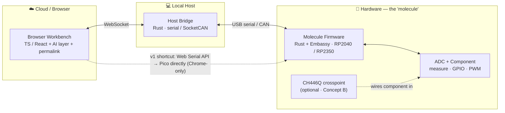

# Mini-Molecule + Cloud Workbench — POC

> A desk-scale, browser-driven replica of [Adom](.arche/entities/adom-industries.md)'s entire product loop — **design → wire → measure → understand** — built on Adom's own open-source stack.

**In short:** I built a small modular board — a *"molecule"* — that **announces what it can do on a bus**, is **driven entirely from a web browser**, can **measure and actuate a real circuit remotely**, and has an **AI layer that runs a test and explains the result in plain English** — with a shareable link so anyone can reproduce it. I designed every piece to map onto a recognizable slice of Adom's product, rather than ship a generic microcontroller demo.

---

## The whole system, one picture

You type or speak an intent in the browser; it travels down to firmware on the board, which measures or drives a real component and streams the value back up.



The pragmatic **v1** collapses the middle: the browser talks straight to the Pico over the **Web Serial API** (Chrome-only) — the browser-to-serial pattern [John Lauer](.arche/entities/john-lauer.md) pioneered with SPJS/ChiliPeppr. **v2** adds the Rust bridge, CAN, and the AI layer.

### What it physically does

| Capability | What you see |
| :--------- | :----------- |
| **GPIO** | Flashes / toggles an LED on and off. |
| **PWM** | Dims that LED — or spins a small DC fan/motor at variable speed. |
| **ADC** | Reads a sensor (pot or thermistor) and streams the live value to the browser. |
| **+B** *(optional)* | Software-wires a component into the measurement path, then measures it. |
| **+D** *(stretch)* | Actually turns stepper motors via Gcode typed in the browser. |

**The point isn't the blinking LED** — it's that the *whole loop* runs end to end: browser → board → real circuit → live readout → AI explanation → shareable permalink.

---

## What each piece does — and how it maps to Adom

I scoped the work as four concepts, each mapping to a different slice of Adom's architecture ([reconstructed here](.arche/concepts/adom-technical-architecture.md)). **A** is the core build, **B** a natural extension; **C** and **D** are described to show where the approach leads.

| | Concept | What it does | Maps to | Scope |
| :- | :------ | :----------- | :------ | :---- |
| **A** | **Mini-Molecule + Cloud Workbench** *(the spine)* | The full vertical slice: self-identifies on a bus (`{id, name, capabilities}`), driven from the browser, remote measure + actuate (ADC/GPIO/PWM streamed live), AI layer (NL → test → plain-English readout), shareable permalink. | **The whole product** — molecule + module bus + Rust→TS control plane + Hydrogen-Desktop agent. | **Core build** |
| **B** | **Programmable Patch Matrix** | A `CH446Q` analog crosspoint (the ~$2 Jumperless chip) lets the browser wire a component into the measurement path in software, then measure it. | **The workcell** — programmable wiring, a miniature of Adom's robot-wiring. See [Programmable Wiring](.arche/concepts/programmable-wiring.md). | Extension |
| **C** | **Remote Bring-Up Box** | An Arduino test fixture: power-cycle a board-under-test, poke an input, measure output, run an automated pass/fail suite, report to a dashboard. "CI/CD for hardware." | **The white space** — [automated remote bring-up](.arche/concepts/automated-remote-bring-up.md), the genuinely unsolved problem. | On the roadmap |
| **D** | **Gcode Molecule Mover** | A 2-axis motion rig driven by Gcode typed in the browser → serial → stepper pulses. | **The robot motion** — Adom's Klipper 8-axis fork for wire-bending pincers. | Stretch goal |

---

## What the full POC delivers

Together, **A + B** exercise **five of Adom's core pillars** at once, for a **~$20–30** bill of materials:

1. **Molecule** — self-identifying board *(A)*
2. **Programmable wiring** — CH446Q crosspoint *(B)*
3. **Remote measurement** — ADC / GPIO / PWM *(A)*
4. **AI layer** — natural language → test → readout *(A)*
5. **Reproducibility** — shareable permalink *(A)*

**Build path:**

| | v1 — prove the loop | v2 — make it Adom-shaped |
| :- | :------------------ | :----------------------- |
| **Effort** | a couple of weekends | add the signal-maxing pieces |
| **Scope** | Browser → Web Serial → Pico · self-ID + read ADC + toggle GPIO/PWM · live value streaming · no bridge/CAN/AI yet | Add CAN via MCP2515 + Rust bridge · add the AI test-plan + readout layer · add permalink reproducibility · bolt on Concept B crosspoint |

See the full parts list in [the hardware BOM](.arche/queries/poc-hardware-bom.md).

---

## Why I built it this way

Rather than reach for a generic microcontroller demo, I built directly on Adom's own open-source crates — `postcard-rpc` (messaging), `mcp2515` (CAN), `tsify` (Rust→TypeScript types), and the `Embassy` firmware fork. The aim was to show, concretely, that I can pick up your stack and use it to recreate a working slice of your product — not just describe one.

---

## Quickstart (Foundation)

This repo's dev environment is managed by [devbox](https://www.jetify.com/devbox).
From a clean checkout:

1. Install [devbox](https://www.jetify.com/devbox) + [direnv](https://direnv.net), then `cd` into the repo (direnv auto-activates),
   or prefix commands with `devbox run --`.
2. First build (installs the pinned toolchain + targets automatically):

   ```bash
   devbox run -- just build
   ```

3. Run the full acceptance gate (build + drift guard + lint + tests):

   ```bash
   devbox run -- just check
   ```

4. See the molecule in the browser:

   ```bash
   devbox run -- just dev
   ```

   Open the printed Vite URL in Chrome — it shows the simulator's `id` and `name`.

### Recipes

| Recipe           | Does                                                            |
|------------------|----------------------------------------------------------------|
| `just gen`       | regenerate `web/src/contract.gen.ts` from the Rust contract    |
| `just check-gen` | drift guard: fail if the generated type is stale               |
| `just build`     | build all four parts (contract, simulator, web, firmware)      |
| `just check`     | `build` + drift guard + clippy + tests — the CI/acceptance gate |
| `just dev`       | run the simulator + web dev server (the primary scenario)      |

---

## Design notes & research

The thinking behind the project — how I decoded Adom's public stack, the prior-art landscape I worked through, and the parts list — lives under [`.arche/`](.arche/index.md):

- [POC: Mini-Molecule + Cloud Workbench](.arche/concepts/poc-mini-molecule-cloud-workbench.md) — the build spec
- [Adom Technical Architecture](.arche/concepts/adom-technical-architecture.md) — the stack each concept maps to
- [Hardware BOM](.arche/queries/poc-hardware-bom.md) — concrete parts list
- [Visual explainer](.arche/stories/poc-explainer-for-self.md) — a one-page version of this README with the diagram
